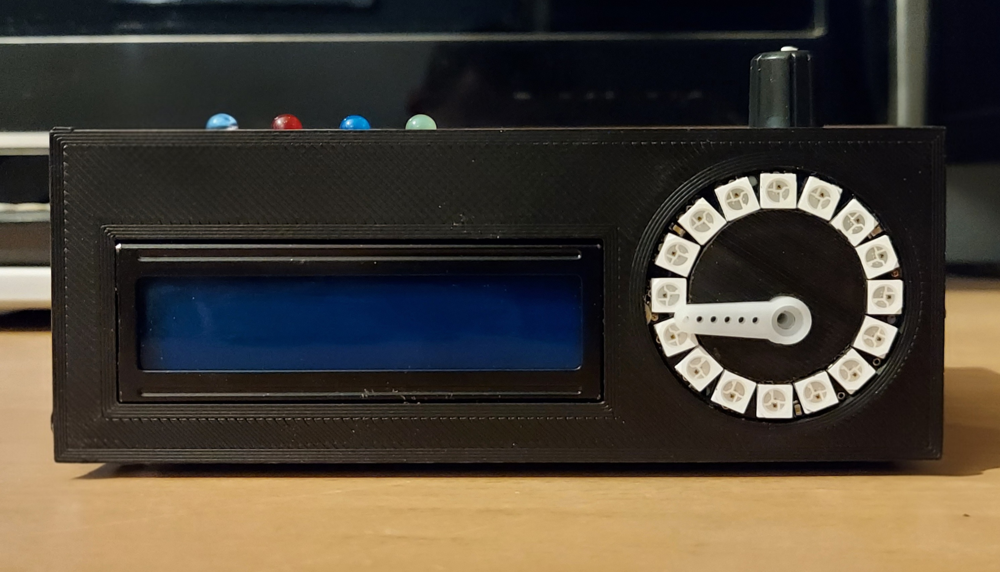
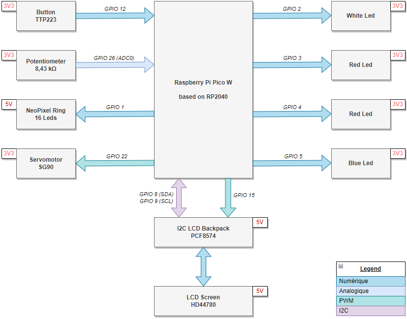

# Animated Weather Dashboard 🌤️

**Animated Weather Dashboard** is an interactive and animated weather dashboard prototype designed to display weather forecasts over a configurable time range. This project uses a **Raspberry Pi Pico W** to fetch real-time data via the OpenWeatherMap API and visualize it through a multi-modal interface (LCD, NeoPixels, analog gauge, and LED alerts).



---

## Key Features

* **Comprehensive Weather Data:** Displays temperature, humidity, wind speed/direction, gusts, atmospheric pressure, and general conditions (clouds, rain, snow, thunderstorm, etc.).
* **Interactive Time-Travel:** Navigate through weather forecasts using a rotary potentiometer (from "Now" up to several days ahead in 3-hour increments) and navigate through 6 display menus using a push button.
* **Extreme Weather Alerts:** 4 dedicated warning LEDs trigger automatically for specific hazardous conditions: frost/freezing rain, heatwaves (≥30°C), strong winds (≥80km/h), and extreme rain.
* **Analog Gauge Display:** A servo motor acts as a physical dashboard needle to dynamically represent metrics like temperature, humidity, and wind speed.
* **Dynamic Light Animations:** A 16-LED NeoPixel ring visually represents current weather conditions through custom color animations (e.g., pulsing rain, flashing thunderstorms, rotating sunshine).

---

## Hardware Requirements

* **Raspberry Pi Pico W** (Required for Wi-Fi connectivity)
* **NeoPixel Ring** (16 LEDs) connected to Pin 1
* **16x2 LCD Screen** with I2C module (SDA Pin 8, SCL Pin 9) + Backlight PWM control
* **Servo Motor** for analog gauge (PWM on Pin 22)
* **4x Standard LEDs** for alerts: Freezing (White), Rain (Blue), Wind (Yellow), Heat (Red)
* **Push Button** for menu navigation (Pin 12)
* **Potentiometer** for time range selection (ADC Pin 26)

### System Block Diagram


---

## Software Architecture

The MicroPython codebase is highly modular. All source files are located in the `Codes/` directory:

* **`main.py`**: The core orchestrator. It uses hardware timers (`Timer1`, `Timer2`, `Timer3`) to independently schedule data updates, potentiometer readings, and display refreshes. It also sets up a hardware interrupt (IRQ on falling edge) for the menu button.
* **`hardware_setup.py`**: Handles the initialization of the I2C bus for the LCD, PWM frequencies for the servo (50Hz) and backlight, ADC for the potentiometer, and the Wi-Fi connection loop. It includes the logic mapping the potentiometer's analog value to specific days and hours.
* **`data_logging.py`**: Manages the `urequests` HTTP calls to the OpenWeatherMap API. It extracts and parses the JSON response into a simplified 12-element list (`weather_forecast`), retrieving specific metrics (temp, humidity, pressure, wind gust, pop) based on the chosen time index.
* **`display_data.py`**: The central UI controller. Based on the `menuCounter` (0 to 5), it dictates what is written on the LCD, calculates the appropriate duty cycle for the Servo to act as a gauge, evaluates the thresholds for the 4 warning LEDs, and triggers the correct NeoPixel states.
* **`neopixel_ring.py`**: A low-level driver utilizing the Pico's `rp2.asm_pio` (Programmable I/O) state machines to bit-bang the WS2812 protocol at 8MHz. It contains specific animation loops (fixed, flashed, animated) using arrays to manipulate GRB color data efficiently.
* **`color_map.py`**: Defines all the RGB constants and the specific ring patterns (e.g., `RING_SUNSHINE_1`, `RING_STORMY_1`) used by the NeoPixels.
* **`lcd/`**: Directory containing the `pico_i2c_lcd` hardware drivers.

---

## Installation & Setup

1. **Prepare the Pico W:** Ensure your Raspberry Pi Pico W is flashed with the latest MicroPython firmware.
2. **Clone the repository:**
   ```bash
   git clone https://github.com/frankabras/Animated_Weather_Dashboard.git
   ```
3. **Configure Credentials:**
   Create a `secrets.py` file inside the `Codes/` directory (or update the existing one) with your Wi-Fi credentials and API key:
   ```python
   my_secrets = {
       "ssid": "Your_WiFi_SSID",
       "WiFi_pass": "Your_WiFi_Password",
       "OWM_API_key": "Your_OpenWeatherMap_API_Key"
   }
   ```
4. **Configure Location:**
   In `main.py`, update the `location` variable with your target longitude and latitude:
   ```python
   location = ["longitude", "latitude"] 
   ```
5. **Upload the Code:**
   Using an IDE like [Thonny](https://thonny.org/), upload the **entire contents** of the `Codes/` directory to the root of your Raspberry Pi Pico W.
6. **Run the Project:**
   Reboot the Pico or run `main.py`. The LCD will display the setup progress, connect to Wi-Fi, fetch the initial data, and start the display sequence.